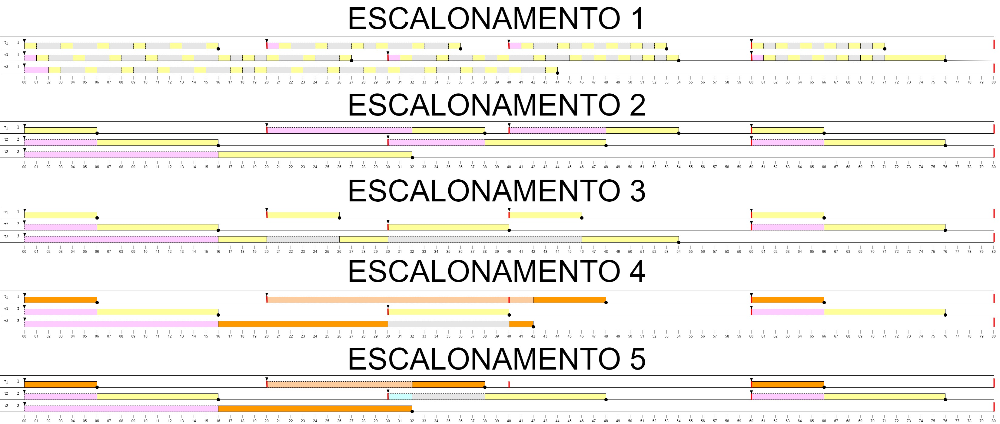

# CSW41

# Escalonamentos

# Escalonamento 1

Tipo: **Time-slice de 50ms, todas tarefas com mesma prioridade**.

Pela imagem é possível perceber que as threads são trocadas de contexto em ordem e também possuem tempos semelhantes de execução.
Apresentando um comportamento próximo do esperado nessa configuração. 

# Escalonamento 2

Tipo: **Sem time-slice sem preempção**

Pela imagem é possível ver que as threads, quando iniciadas, rodam até sua conclusão/liberação de recurso.
Isso ocorre pois não há time-slice ou preempção, portanto para que outra thread se inicie é necessário que a atual finalize para liberar a troca de contexto.

Portanto o comportamento de temporização é como esperado.

# Escalonamento 3

Tipo: **Escalonamento preemptivo por prioridade.**

Pela imagem é possível perceber que, quando uma thread de maior prioridade é iniciada, a atual para imediatamente e o contexto é alterado para thread de maior prioridade.

# Escalonamento 4

Tipo: **Mutex compartilhado entre T1 e T3. No início de cada jobestas tarefas devem solicitar este mutexe liberá-lo no final. Use mutex sem herança de prioridade.**

Nesse caso é possível perceber a espera da tarefa 1 pela liberação do Mutex, para que só assim seja iniciada.
Enquanto isso a tarefa 2 roda independente do estado do atual "dono" do Mutex.

Também, pela falta de herança de prioridade, é possível perceber que a tarefa 3 é interrompida quando criada a tarefa 2.

# Escalonamento 5

Tipo: **Idem Escalonamento 4, mas com herança de prioridade.**

É possível perceber a diferença quando a tarefa 2 é iniciada.
Enquanto sem a herança a tarefa 3 era interrompida, com herança ela não o é.
Também o início da tarefa 2 só se dá após a finalização da tarefa 3 e 1, enquanto antes se dava entre antes da finalização da 3 e também do início da 1.